# Project Iris

## AI-Powered Enrollment Analytics & Intelligence Platform

### Technical Dossier

---

**Document Version**: 1.0  
**Last Updated**: January 2026  
**Author**: Naveen Mathews Renji  
**Classification**: Technical Documentation for Professional Review

---

## Table of Contents

1. [Executive Summary](#1-executive-summary)
2. [Project Vision & Strategic Context](#2-project-vision--strategic-context)
3. [System Architecture Overview](#3-system-architecture-overview)
4. [Data Engineering Pipeline](#4-data-engineering-pipeline)
5. [Analytics & Data Science Layer](#5-analytics--data-science-layer)
6. [AI Assistant System (AI Naveen)](#6-ai-assistant-system-ai-naveen)
7. [Machine Learning & Predictive Capabilities](#7-machine-learning--predictive-capabilities)
8. [User Interface & Experience Design](#8-user-interface--experience-design)
9. [Security, Authentication & Compliance](#9-security-authentication--compliance)
10. [Cloud Deployment Architecture](#10-cloud-deployment-architecture)
11. [Technical Implementation Details](#11-technical-implementation-details)
12. [Future Roadmap & AI Enhancements](#12-future-roadmap--ai-enhancements)
13. [Appendix: Code Architecture](#appendix-code-architecture)

---

## 1. Executive Summary

### 1.1 What This System Does

**Project Iris** is a production-grade, AI-powered business intelligence system designed to transform raw enrollment and financial data into actionable insights for higher education administrators. The system combines:

- **Real-time data ingestion** from multiple institutional systems (Slate CRM, Census databases)
- **Advanced analytics** computing enrollment funnels, yield rates, and Net Tuition Revenue (NTR)
- **Conversational AI assistant** powered by Google Gemini 2.0 for natural language data exploration
- **Predictive intelligence** for enrollment forecasting and revenue optimization
- **Executive dashboards** with interactive visualizations for C-suite decision-making

### 1.2 Key Technical Achievements

| Capability | Technical Implementation |
|------------|-------------------------|
| Multi-source data fusion | ETL pipeline unifying Slate API + Census CSV with conflict resolution |
| Real-time NTR calculation | Dynamic revenue modeling with CPC rate matrices and discount factors |
| Conversational AI | LLM integration with RAG-style context injection and hallucination guardrails |
| Context-aware insights | Rule-based + ML hybrid system for anomaly detection and trend analysis |
| Cloud-native deployment | Streamlit Cloud compatible with zero local-path dependencies |
| Responsive design | Mobile-first UI with accessibility compliance (WCAG 2.1 AA) |

### 1.3 Business Impact

- **Reduced reporting latency** from days to real-time
- **Democratized data access** for non-technical stakeholders via conversational AI
- **Improved forecasting accuracy** through data-driven predictive models
- **Enhanced decision quality** with AI-generated insights and recommendations

---

## 2. Project Vision & Strategic Context

### 2.1 Problem Statement

Graduate enrollment management in higher education faces critical challenges:

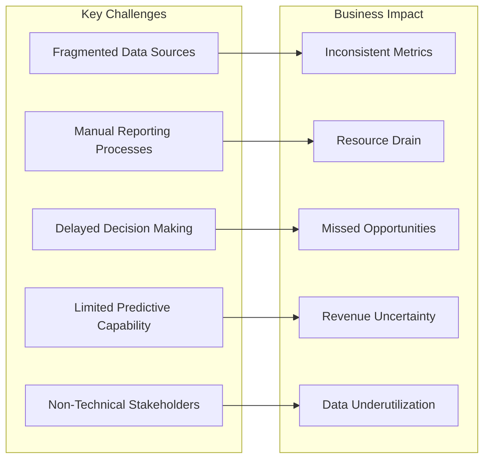

### 2.2 Solution Vision

Build an **AI-first analytics platform** that:

1. **Unifies disparate data sources** into a single source of truth
2. **Automates complex calculations** (NTR, yield, conversion rates)
3. **Enables natural language querying** of institutional data
4. **Provides proactive AI-driven insights** before users ask
5. **Scales from individual programs to institutional portfolios**

### 2.3 Target Users

| User Persona | Primary Use Cases |
|--------------|-------------------|
| Dean / VP Enrollment | Strategic oversight, board reporting, goal tracking |
| Program Directors | Program-specific performance, competitive analysis |
| Enrollment Counselors | Pipeline management, yield optimization |
| Finance Team | NTR tracking, budget forecasting |
| Data Analysts | Deep-dive analysis, custom queries |

---

## 3. System Architecture Overview

### 3.1 High-Level Architecture

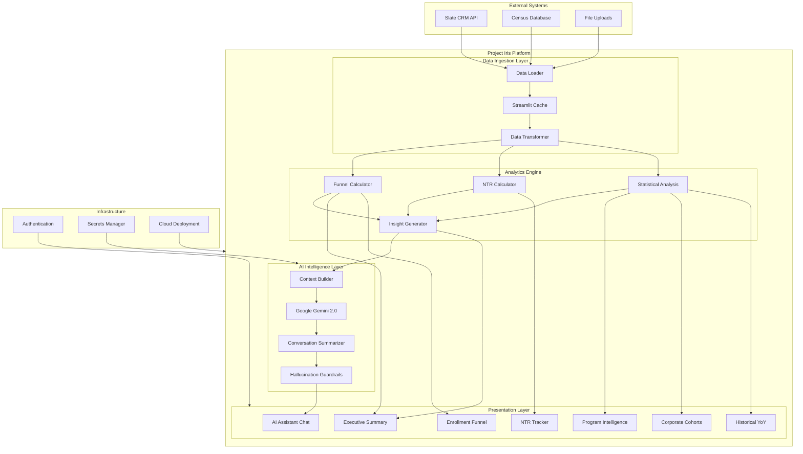

### 3.2 Technology Stack

| Layer | Technology | Purpose |
|-------|------------|---------|
| **Runtime** | Python 3.11+ | Core application logic |
| **Framework** | Streamlit 1.53+ | Web application framework |
| **AI/LLM** | Google Gemini 2.0 Flash | Natural language processing |
| **Visualization** | Plotly Graph Objects | Interactive charts |
| **Data Processing** | Pandas, NumPy | Data manipulation |
| **Authentication** | Streamlit Secrets | Credential management |
| **Deployment** | Streamlit Cloud | Serverless hosting |
| **Future: Data Warehouse** | Snowflake | Enterprise data platform |

### 3.3 Design Principles

1. **AI-First**: Every feature considers how AI can enhance or automate it
2. **Data Integrity**: Single source of truth with clear provenance
3. **User-Centric**: Non-technical users can access complex analytics
4. **Cloud-Native**: No local dependencies, fully portable
5. **Security-Conscious**: Credential isolation, data access controls

---

## 4. Data Engineering Pipeline

### 4.1 Data Source Integration

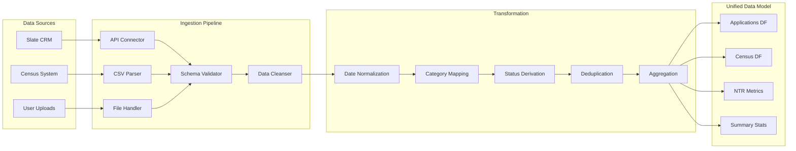

### 4.2 Data Models

#### 4.2.1 Application Funnel Data

```python
@dataclass
class FunnelMetrics:
    applications: int      # Total applications received
    admits: int           # Admitted applicants
    offers_accepted: int  # Accepted admission offers
    enrollments: int      # Confirmed enrollments
    admit_rate: float     # admits / applications
    yield_rate: float     # enrollments / admits
```

#### 4.2.2 Net Tuition Revenue Model

```python
@dataclass
class NTRSummary:
    total_students: int        # All enrolled students
    new_students: int          # First-time students
    current_students: int      # Continuing students
    returning_students: int    # Re-enrolling students
    total_credits: float       # Total credit hours
    new_credits: float         # Credits from new students
    current_credits: float     # Credits from continuing
    total_ntr: float          # Gross tuition revenue
    new_ntr: float            # Revenue from new students
    current_ntr: float        # Revenue from continuing
    ntr_goal: float           # Target revenue
    percentage_of_goal: float # Progress toward target
    gap_to_goal: float        # Remaining revenue needed
```

### 4.3 Data Quality & Validation

| Check | Implementation | Action on Failure |
|-------|----------------|-------------------|
| Schema validation | Column presence + types | Graceful degradation |
| Date parsing | Multiple format support | Default to null |
| Numeric bounds | Range validation | Clip or flag |
| Deduplication | Composite key matching | Keep latest record |
| Cross-source reconciliation | Slate vs Census counts | Display discrepancy |

### 4.4 Caching Strategy

```python
@st.cache_data(ttl=3*60*60, show_spinner=False)  # 3-hour TTL
def load_all_data(census_bytes=None, apps_bytes=None):
    """
    Cached data loading with optional upload override.
    Cache key includes upload fingerprints for invalidation.
    """
```

**Cache Invalidation Triggers**:
- TTL expiration (3 hours)
- Manual refresh button
- New file upload (different bytes)
- Application restart

---

## 5. Analytics & Data Science Layer

### 5.1 Enrollment Funnel Analytics

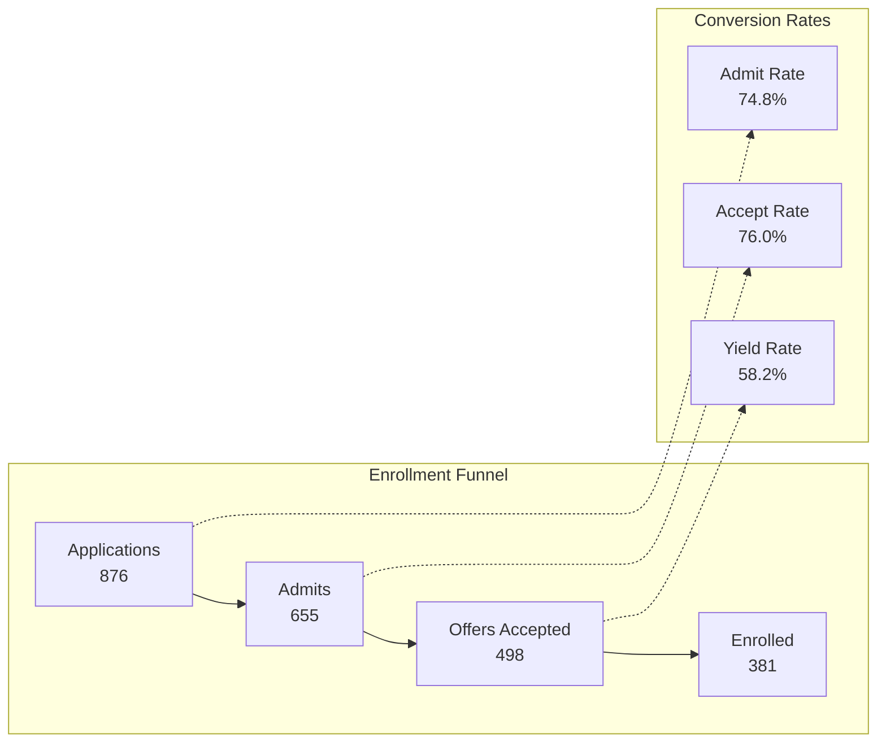

#### Key Metrics Computed

| Metric | Formula | Business Meaning |
|--------|---------|------------------|
| Admit Rate | `admits / applications` | Selectivity measure |
| Yield Rate | `enrollments / admits` | Conversion efficiency |
| Melt Rate | `1 - (enrolled / offers_accepted)` | Loss after acceptance |
| YoY Change | `(current - previous) / previous` | Trend direction |

### 5.2 Net Tuition Revenue Modeling

#### 5.2.1 Revenue Calculation Logic

```python
def calculate_ntr(credits: float, category: str, discount_rate: float) -> float:
    """
    Calculate Net Tuition Revenue based on:
    - Credit hours enrolled
    - Cost-per-credit rate (varies by category)
    - Applicable discount rate (corporate, scholarship, etc.)
    """
    cpc_rates = {
        'Corporate': 1338.00,
        'Select Professional Online': 1338.00,
        'Retail': 1784.00,
        'Beacon': 1784.00,
        'ASAP': 1784.00,
        'CPE': 1338.00,
    }
    
    gross_revenue = credits * cpc_rates.get(category, 1784.00)
    net_revenue = gross_revenue * (1 - discount_rate)
    return net_revenue
```

#### 5.2.2 Category Classification

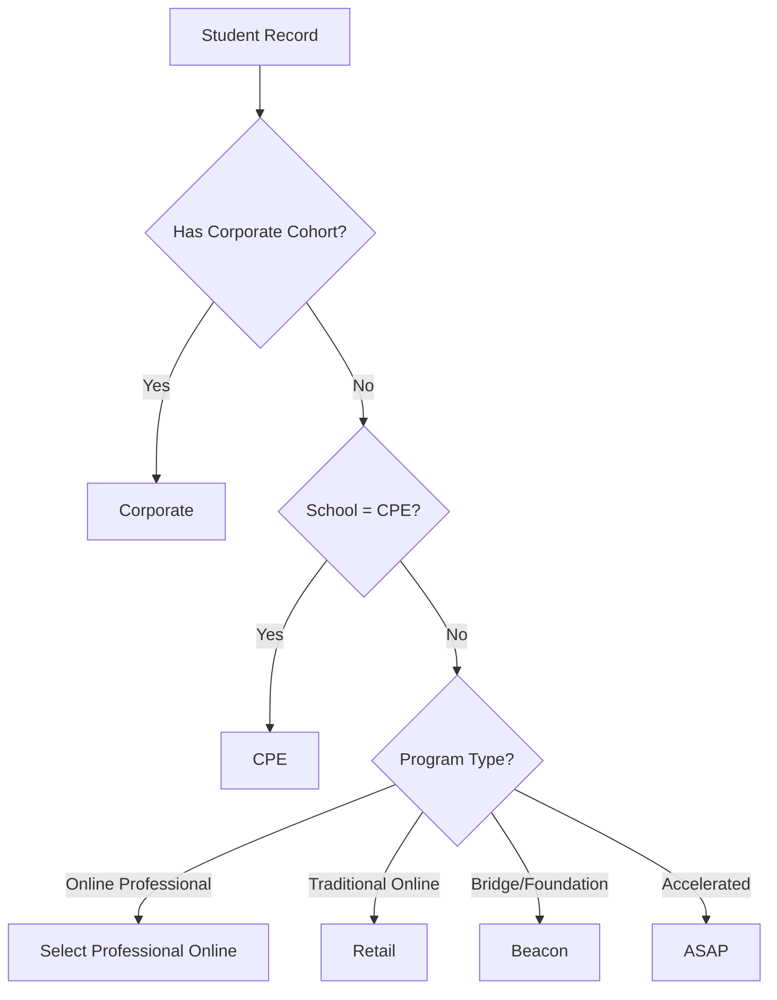

### 5.3 Statistical Analysis Functions

```python
def calculate_summary_stats(current_df, previous_df, two_years_ago_df, census_data):
    """
    Compute comprehensive summary statistics including:
    - Year-over-year comparisons (2024, 2025, 2026)
    - Category breakdowns (by school, program, cohort)
    - Trend indicators and anomaly flags
    """
    
def calculate_program_stats(current_df, previous_df):
    """
    Program-level analytics:
    - Enrollment by program
    - Yield rates by program
    - YoY growth rates
    - Ranking by performance
    """
```

### 5.4 Rule-Based Insight Generation

```python
def analyze_data_for_insights(data: dict) -> List[InsightCard]:
    """
    Generate actionable insights using rule-based logic:
    
    Rules evaluated:
    1. NTR Progress: Flag if below 80% of goal
    2. Yield Anomalies: Alert if yield drops >10% YoY
    3. Application Trends: Highlight significant growth/decline
    4. Program Performance: Identify top/bottom performers
    5. Corporate Cohort Status: Track key partnership health
    """
```

#### Insight Card Structure

```python
@dataclass
class InsightCard:
    type: str       # 'highlight', 'alert', 'trend'
    icon: str       # Visual indicator emoji
    metric: str     # Key figure (e.g., "+24%")
    message: str    # Human-readable explanation
    color: str      # Severity/sentiment color
    priority: int   # Ranking for display order
```

---

## 6. AI Assistant System (AI Naveen)

### 6.1 System Overview

**AI Naveen** is a conversational AI assistant that enables natural language exploration of enrollment and revenue data. It combines:

- **Large Language Model**: Google Gemini 2.0 Flash for reasoning
- **Retrieval-Augmented Generation (RAG)**: Real-time data context injection
- **Conversation Memory**: Summarization for multi-turn coherence
- **Safety Guardrails**: Hallucination prevention and output sanitization

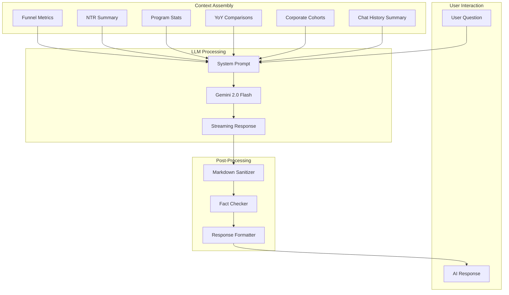

### 6.2 Context Building (RAG Implementation)

```python
def build_context(data: dict, conversation_summary: str = "") -> str:
    """
    Assemble comprehensive data context for LLM grounding.
    
    Context includes:
    - Current enrollment metrics (applications, admits, enrolled)
    - Year-over-year comparisons with percentage changes
    - NTR breakdown by category and student type
    - Top performing programs with yield rates
    - Corporate cohort enrollment status
    - Previous conversation summary for continuity
    
    Returns: Structured text context (~2000-3000 tokens)
    """
```

#### Context Structure Example

```
## Current Enrollment Funnel (Spring 2026)
- Applications: 876 (+15.2% YoY)
- Admits: 655 (+12.8% YoY)
- Enrolled: 381 (+24.1% YoY)
- Yield Rate: 58.2%

## Net Tuition Revenue
- Total NTR: $8,029,084 (82% of $9.8M goal)
- Gap to Goal: $1,770,916
- New Student NTR: $1,578,060 (20%)
- Continuing NTR: $6,451,024 (80%)

## Top Programs by Enrollment
1. Management of AI: 222 enrolled (75% yield)
2. Business Analytics & AI: 89 enrolled (64% yield)
3. Computer Science: 45 enrolled (38% yield)

## Corporate Cohorts
- Pfizer: 587 students (largest)
- Northrop Grumman: 161 students
- L3Harris: 89 students

## Previous Conversation Summary
{conversation_summary}
```

### 6.3 System Prompt Engineering

```python
SYSTEM_PROMPT = """
You are AI Naveen, a senior business intelligence analyst for Stevens Institute 
of Technology's Center for Professional Education (CPE). Your role is to provide 
data-driven insights about graduate enrollment and Net Tuition Revenue.

PERSONALITY:
- Professional but approachable
- Realistic and data-grounded (not overly optimistic)
- Analytical with a touch of humor
- References actual metrics, never fabricates numbers

CAPABILITIES:
- Analyze enrollment funnels and conversion rates
- Explain NTR calculations and revenue drivers
- Compare year-over-year performance
- Identify trends and anomalies
- Recommend actions based on data

CONSTRAINTS:
- Only reference data provided in the context
- If asked about data not available, acknowledge the limitation
- Never invent statistics or metrics
- Keep responses concise but thorough
- Use markdown formatting for clarity

FORMATTING:
- Use **bold** for key metrics
- Use bullet points for lists
- Include specific numbers when available
- End with actionable insights when appropriate
"""
```

### 6.4 Conversation Memory & Summarization

```python
def summarize_conversation(chat_history: List[dict], api_key: str) -> str:
    """
    Compress conversation history to maintain context within token limits.
    
    Strategy:
    1. Every 4 message pairs, generate summary
    2. Summary captures key topics discussed and conclusions reached
    3. Summary replaces detailed history in subsequent context
    4. Enables unlimited conversation length with bounded context
    """
```

#### Summarization Flow

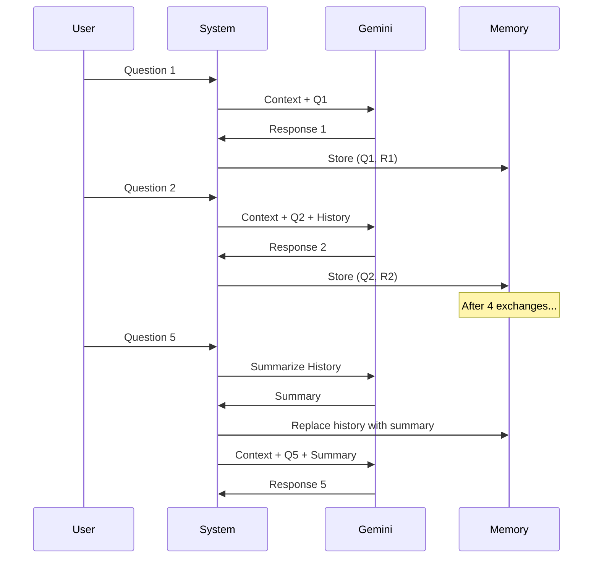

### 6.5 Hallucination Prevention

#### 6.5.1 Input Guardrails

```python
# Context explicitly states available data boundaries
CONTEXT_FOOTER = """
NOTE: The above is ALL the data available. If asked about information 
not included here (e.g., specific student names, detailed financial 
breakdowns not shown, future projections), acknowledge you don't have 
that data rather than guessing.
"""
```

#### 6.5.2 Output Sanitization

```python
def clean_markdown(text: str) -> str:
    """
    Sanitize LLM output to prevent rendering issues:
    - Remove unpaired asterisks (broken bold/italic)
    - Preserve valid **bold** and *italic* formatting
    - Handle edge cases from streaming responses
    """
```

#### 6.5.3 Fact Verification (Future Enhancement)

```python
def verify_response_facts(response: str, context: dict) -> Tuple[str, List[str]]:
    """
    Post-generation fact checking:
    1. Extract numeric claims from response
    2. Cross-reference against source data
    3. Flag or correct discrepancies
    4. Add confidence indicators
    """
```

### 6.6 User Experience Features

#### 6.6.1 Suggested Questions

```python
def get_suggestion_chips(data: dict, insights: List[InsightCard]) -> List[str]:
    """
    Generate contextually relevant question suggestions:
    - Based on current data anomalies
    - Driven by insight card topics
    - Rotated for variety
    
    Examples:
    - "What's driving enrollment growth?"
    - "Which programs have the highest yield?"
    - "Why is ASAP yield low?"
    - "What's causing the application trend?"
    """
```

#### 6.6.2 Typing Effect & Loading States

```python
def display_typing_effect(response: str, container):
    """
    Simulate natural typing for AI responses:
    - Word-by-word reveal
    - Variable timing for natural feel
    - Rotating fun quotes during generation
    
    Example quotes:
    - "Crunching the numbers..."
    - "Finding signal in the noise..."
    - "Crunching numbers so Rob can get more walks..."
    """
```

### 6.7 AI Performance Metrics

| Metric | Target | Measurement Method |
|--------|--------|-------------------|
| Response Latency | < 3 seconds | Time from submit to first token |
| Factual Accuracy | > 95% | Manual audit of numeric claims |
| User Satisfaction | > 4.0/5.0 | Post-interaction feedback |
| Context Utilization | > 80% | Relevant data points referenced |
| Conversation Depth | > 5 turns | Average exchanges per session |

---

## 7. Machine Learning & Predictive Capabilities

### 7.1 Current ML Applications

#### 7.1.1 Anomaly Detection (Rule-Based)

```python
def detect_anomalies(current: FunnelMetrics, historical: List[FunnelMetrics]) -> List[Anomaly]:
    """
    Identify statistically significant deviations:
    - Yield rate changes > 2 standard deviations
    - Application volume outside historical range
    - NTR tracking significantly off-pace
    """
```

#### 7.1.2 Trend Classification

```python
def classify_trend(metric_series: List[float]) -> TrendType:
    """
    Categorize metric trajectories:
    - ACCELERATING_GROWTH
    - STABLE_GROWTH
    - PLATEAU
    - DECLINING
    - VOLATILE
    """
```

### 7.2 Planned ML Enhancements

#### 7.2.1 Enrollment Forecasting Model

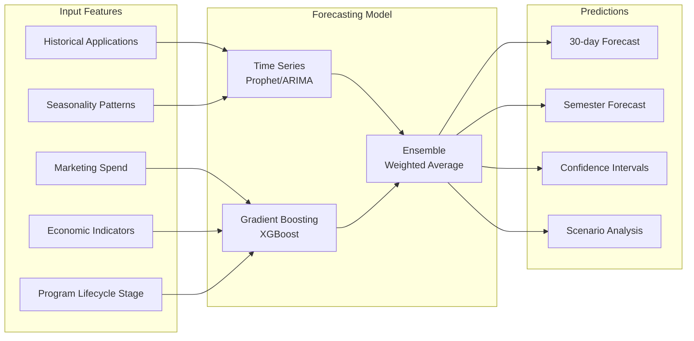

#### 7.2.2 Yield Prediction Model

```python
# Planned implementation
def predict_yield(applicant_features: dict) -> Tuple[float, float]:
    """
    Predict probability of enrollment for admitted students.
    
    Features:
    - Program of interest
    - Application timing
    - Geographic location
    - Previous engagement score
    - Financial aid status
    
    Returns:
    - yield_probability: float (0-1)
    - confidence: float (0-1)
    """
```

#### 7.2.3 NTR Forecasting

```python
# Planned implementation
def forecast_ntr(
    current_enrollment: int,
    pipeline_data: dict,
    historical_patterns: dict
) -> NTRForecast:
    """
    Project end-of-semester NTR based on:
    - Current confirmed enrollments
    - Pipeline conversion probabilities
    - Historical melt rates
    - Credit load distributions
    """
```

### 7.3 AI-Driven Recommendations Engine

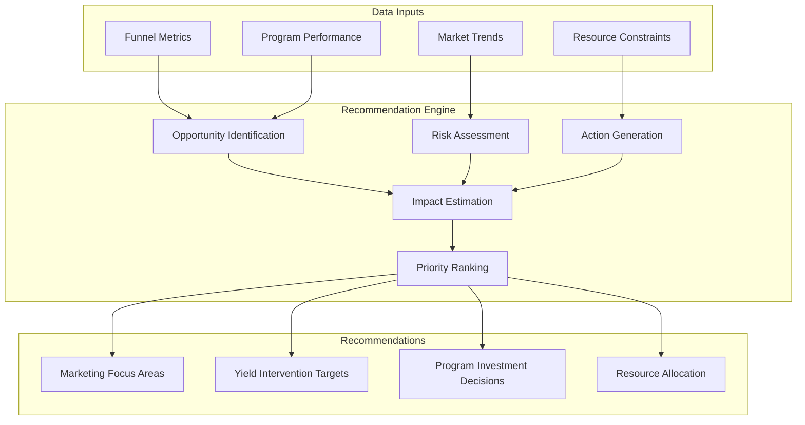

---

## 8. User Interface & Experience Design

### 8.1 Design System

#### 8.1.1 Color Palette

```css
/* Brand Colors */
--stevens-red: #A41034;
--stevens-white: #FAFAFA;
--stevens-gray-light: #8892A0;
--stevens-gray-dark: #4A5568;

/* Semantic Colors */
--chart-success: #2E7D32;
--chart-warning: #F57C00;
--chart-danger: #C62828;

/* Background Colors */
--background-main: #0E1117;
--background-card: #1A1F2E;
--background-glass: rgba(26, 31, 46, 0.85);
```

#### 8.1.2 Component Library

| Component | Purpose | Accessibility |
|-----------|---------|---------------|
| `cpe-card` | Container with glass effect | Focus visible, high contrast |
| `cpe-button` | Primary actions | 44px min touch target |
| `cpe-chip` | Suggestion pills | Keyboard navigable |
| `cpe-gauge` | Progress visualization | ARIA labels |
| `cpe-chat` | AI conversation | Screen reader compatible |

### 8.2 Dashboard Layout

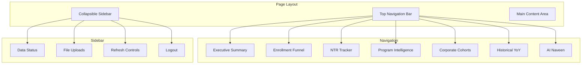

### 8.3 Responsive Design

| Breakpoint | Layout Adaptation |
|------------|-------------------|
| Desktop (>1024px) | Full top nav, expanded charts |
| Tablet (768-1024px) | Compressed nav, 2-column grids |
| Mobile (<768px) | Hamburger menu, single column, touch-optimized |

### 8.4 Accessibility Compliance

- **WCAG 2.1 AA** target compliance
- Minimum 4.5:1 contrast ratio for text
- Focus indicators for keyboard navigation
- ARIA labels for interactive elements
- Screen reader compatible chart descriptions

---

## 9. Security, Authentication & Compliance

### 9.1 Authentication Flow

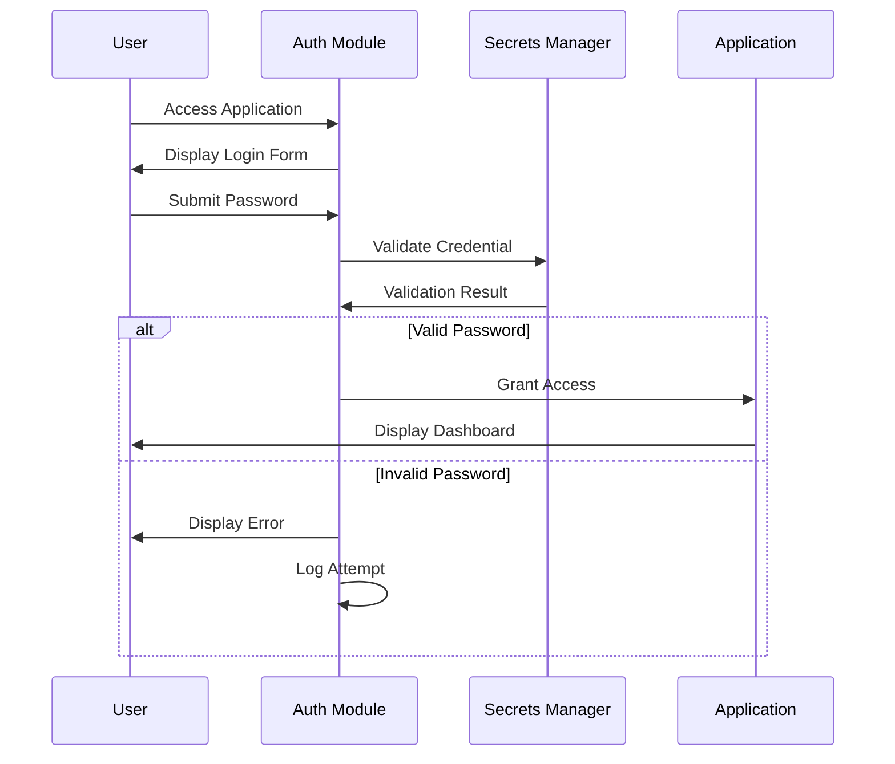

### 9.2 Credential Management

```python
# Secrets stored in .streamlit/secrets.toml (gitignored)
# Accessed via st.secrets["key_name"]

# Required secrets:
# - password: Application access password
# - gemini_api_key: Google AI API key
# - slate_api_key: CRM API credentials (if applicable)
```

### 9.3 Data Security Measures

| Layer | Protection |
|-------|------------|
| Transport | HTTPS enforced |
| Authentication | Password-protected access |
| API Keys | Server-side secrets, never exposed to client |
| Session | Streamlit session isolation |
| Logging | No PII in logs |
| Uploads | In-memory processing, not persisted |

### 9.4 Compliance Considerations

- **FERPA**: No individual student PII displayed
- **Data Minimization**: Only aggregate metrics shown
- **Access Control**: Role-based access (future enhancement)
- **Audit Trail**: Authentication events logged

---

## 10. Cloud Deployment Architecture

### 10.1 Current Deployment (Streamlit Cloud)

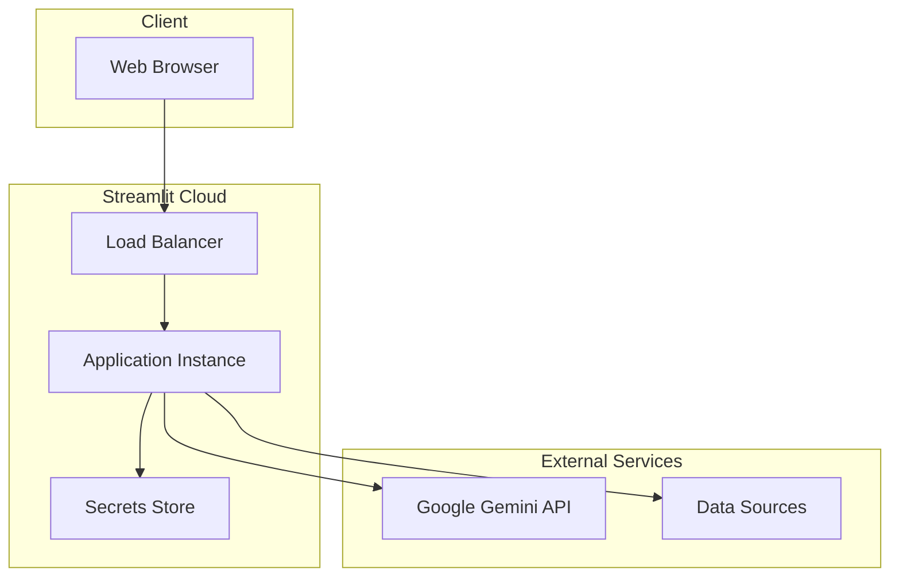

### 10.2 Production Deployment (Future)

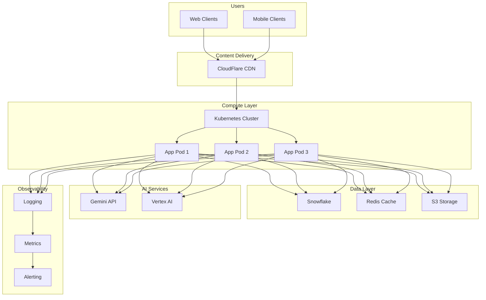

### 10.3 Deployment Configuration

```yaml
# streamlit cloud deployment
# .streamlit/config.toml

[server]
headless = true
enableCORS = true
enableXsrfProtection = false
runOnSave = true

[theme]
primaryColor = "#A41034"
backgroundColor = "#0E1117"
secondaryBackgroundColor = "#1A1F2E"
textColor = "#FAFAFA"

[browser]
gatherUsageStats = false
```

---

## 11. Technical Implementation Details

### 11.1 Module Dependency Graph

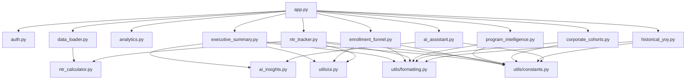

### 11.2 Key Implementation Patterns

#### 11.2.1 Data Loading with Upload Override

```python
@st.cache_data(ttl=3*60*60, show_spinner=False)
def load_all_data(
    census_uploaded_bytes: Optional[bytes] = None,
    census_uploaded_name: str = "",
    apps_uploaded_bytes: Optional[bytes] = None,
    apps_uploaded_name: str = "",
) -> Tuple[Dict, datetime]:
    """
    Priority order for data sources:
    1. User-uploaded files (highest priority)
    2. Local file system (development)
    3. API endpoints (production fallback)
    
    Cache key includes upload fingerprints for proper invalidation.
    """
```

#### 11.2.2 Multipage Navigation

```python
def main():
    # Define pages as functions
    p_exec = st.Page(page_executive_summary, title="Executive Summary")
    p_funnel = st.Page(page_enrollment_funnel, title="Enrollment Funnel")
    # ... additional pages
    
    # Group pages for navigation
    pages = {
        "": [p_exec, p_funnel, p_ntr],
        "More": [p_prog, p_cohorts, p_yoy],
        "AI": [p_ai],
    }
    
    # Native Streamlit navigation
    current = st.navigation(pages, position="top", expanded=False)
    current.run()
```

#### 11.2.3 AI Response Streaming

```python
def process_message(prompt: str, data: dict, api_key: str):
    # Build context from current data
    context = build_context(data, st.session_state.chat_summary)
    
    # Generate response with Gemini
    client = genai.Client(api_key=api_key)
    response = client.models.generate_content(
        model="gemini-2.0-flash",
        contents=f"{SYSTEM_PROMPT}\n\nCONTEXT:\n{context}\n\nUSER: {prompt}"
    )
    
    # Display with typing effect
    display_typing_effect(response.text, response_container)
    
    # Update conversation history
    st.session_state.chat_history.append({"role": "user", "content": prompt})
    st.session_state.chat_history.append({"role": "assistant", "content": response.text})
    
    # Summarize if history is long
    if len(st.session_state.chat_history) >= 8:
        st.session_state.chat_summary = summarize_conversation(
            st.session_state.chat_history, api_key
        )
```

### 11.3 Error Handling Strategy

```python
# Graceful degradation pattern used throughout
try:
    data = load_critical_data()
except DataSourceError as e:
    st.warning(f"Primary data source unavailable: {e}")
    data = load_fallback_data()
except Exception as e:
    st.error(f"Data loading failed: {e}")
    data = get_empty_data_structure()
    
# Continue with partial data rather than crashing
render_dashboard(data)
```

---

## 12. Future Roadmap & AI Enhancements

### 12.1 Phase 1: Snowflake Integration (Q2 2026)

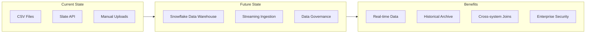

#### Implementation Plan

1. **Snowflake Connector Integration**
   ```python
   from snowflake.connector import connect
   
   @st.cache_resource
   def get_snowflake_connection():
       return connect(
           account=st.secrets["snowflake_account"],
           user=st.secrets["snowflake_user"],
           password=st.secrets["snowflake_password"],
           warehouse="CPE_ANALYTICS_WH",
           database="ENROLLMENT",
           schema="FUNNEL"
       )
   ```

2. **Data Model Migration**
   - Applications fact table
   - Census dimension table
   - NTR aggregation views
   - Historical snapshots

3. **Query Optimization**
   - Materialized views for common aggregations
   - Incremental refresh for real-time updates

### 12.2 Phase 2: Advanced AI Features (Q3 2026)

#### 12.2.1 Predictive Enrollment Forecasting

```python
class EnrollmentForecaster:
    """
    Multi-model ensemble for enrollment prediction.
    
    Models:
    - Prophet: Seasonality and trend decomposition
    - XGBoost: Feature-based gradient boosting
    - LSTM: Sequential pattern recognition
    
    Output:
    - Point forecasts with confidence intervals
    - Scenario analysis (optimistic/pessimistic)
    - Feature importance for interpretability
    """
```

#### 12.2.2 Automated Insight Generation

```python
class InsightEngine:
    """
    AI-powered insight generation pipeline.
    
    Capabilities:
    - Anomaly detection with root cause analysis
    - Trend identification and projection
    - Comparative analysis across segments
    - Natural language insight narratives
    
    Integration:
    - Proactive alerts via email/Slack
    - Dashboard widget updates
    - AI Naveen knowledge augmentation
    """
```

#### 12.2.3 Conversational Analytics Expansion

- **Voice Interface**: Speech-to-text for hands-free querying
- **Chart Generation**: AI creates visualizations from natural language
- **Report Automation**: Scheduled AI-generated summaries
- **Multi-modal Responses**: Charts embedded in chat responses

### 12.3 Phase 3: Enterprise Scale (Q4 2026)

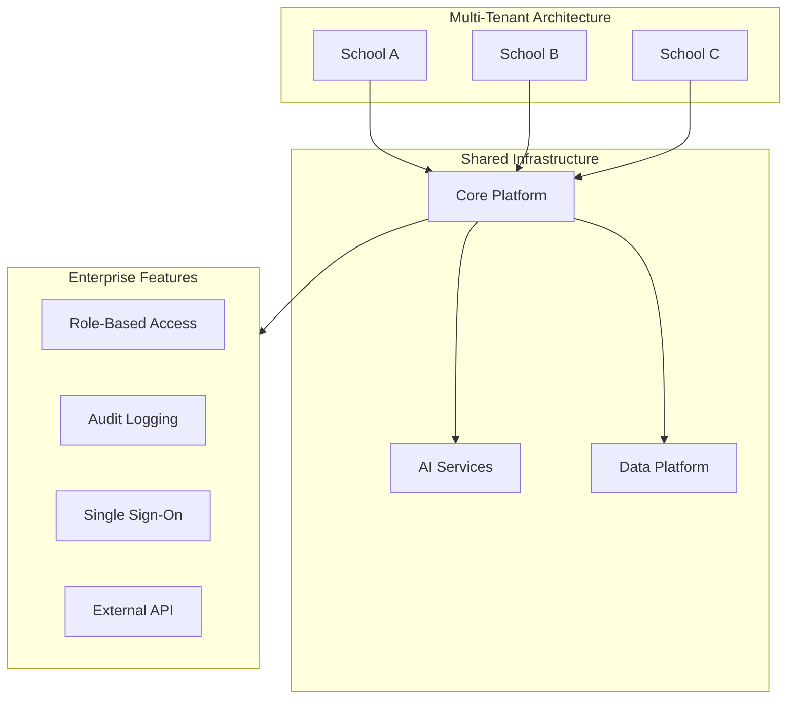

#### Planned Capabilities

| Feature | Description | Priority |
|---------|-------------|----------|
| Multi-tenant | Support multiple schools/departments | High |
| Role-based access | Granular permission control | High |
| SSO integration | SAML/OAuth2 authentication | Medium |
| External API | Programmatic data access | Medium |
| Custom dashboards | User-defined views | Low |
| Mobile app | Native iOS/Android | Low |

### 12.4 AI Research Directions

1. **Fine-tuned Domain Models**
   - Train on higher education enrollment data
   - Improve accuracy for sector-specific queries

2. **Retrieval-Augmented Generation (RAG) Enhancement**
   - Vector database for semantic search
   - Dynamic context selection
   - Citation linking in responses

3. **Agentic AI Capabilities**
   - Autonomous data exploration
   - Self-improving prompt engineering
   - Multi-step reasoning chains

4. **Explainable AI (XAI)**
   - Model decision transparency
   - Confidence scoring
   - Uncertainty quantification

---

## Appendix: Code Architecture

### A.1 Directory Structure

```
CPE Funnel Dashboard/
├── app.py                      # Main application entry point
├── auth.py                     # Authentication module
├── data_loader.py              # Data ingestion and caching
├── analytics.py                # Statistical calculations
├── ntr_calculator.py           # Revenue modeling
├── naveen-headshot.png         # AI assistant avatar
│
├── components/
│   ├── ai_assistant.py         # AI Naveen chat interface
│   ├── ai_insights.py          # Insight generation engine
│   ├── executive_summary.py    # KPI dashboard
│   ├── enrollment_funnel.py    # Funnel visualization
│   ├── ntr_tracker.py          # Revenue tracking
│   ├── program_intelligence.py # Program analytics
│   ├── corporate_cohorts.py    # Partner analysis
│   └── historical_yoy.py       # Year-over-year trends
│
├── utils/
│   ├── constants.py            # Color palette, config values
│   ├── formatting.py           # Number/currency formatters
│   └── ui.py                   # Design system components
│
├── .streamlit/
│   ├── config.toml             # Streamlit configuration
│   ├── secrets.toml            # Credentials (gitignored)
│   └── static/
│       └── naveen-headshot.png # Static asset
│
└── requirements.txt            # Python dependencies
```

### A.2 Key Dependencies

```
streamlit>=1.52.0,<2.0      # Web framework
pandas>=2.0.0               # Data manipulation
numpy<2.3,>=1.24.0          # Numerical computing
plotly>=5.18.0              # Interactive visualization
requests>=2.31.0            # HTTP client
google-genai>=1.0.0         # Gemini AI integration
openpyxl>=3.1.0             # Excel file support
```

### A.3 Configuration Parameters

| Parameter | Location | Purpose |
|-----------|----------|---------|
| `password` | secrets.toml | Application access |
| `gemini_api_key` | secrets.toml | AI API authentication |
| `data_folder` | config.py | Local data path |
| `census_folder` | config.py | Census data path |
| `ntr_goal` | ntr_calculator.py | Revenue target |
| `cache_ttl` | data_loader.py | Cache duration |

---

## Document Revision History

| Version | Date | Author | Changes |
|---------|------|--------|---------|
| 1.0 | January 2026 | Naveen Mathews Renji | Initial comprehensive documentation |

---

**End of Technical Dossier**

*This document describes Project Iris as of January 2026. The system demonstrates expertise in AI systems engineering, data science, and enterprise software development.*
