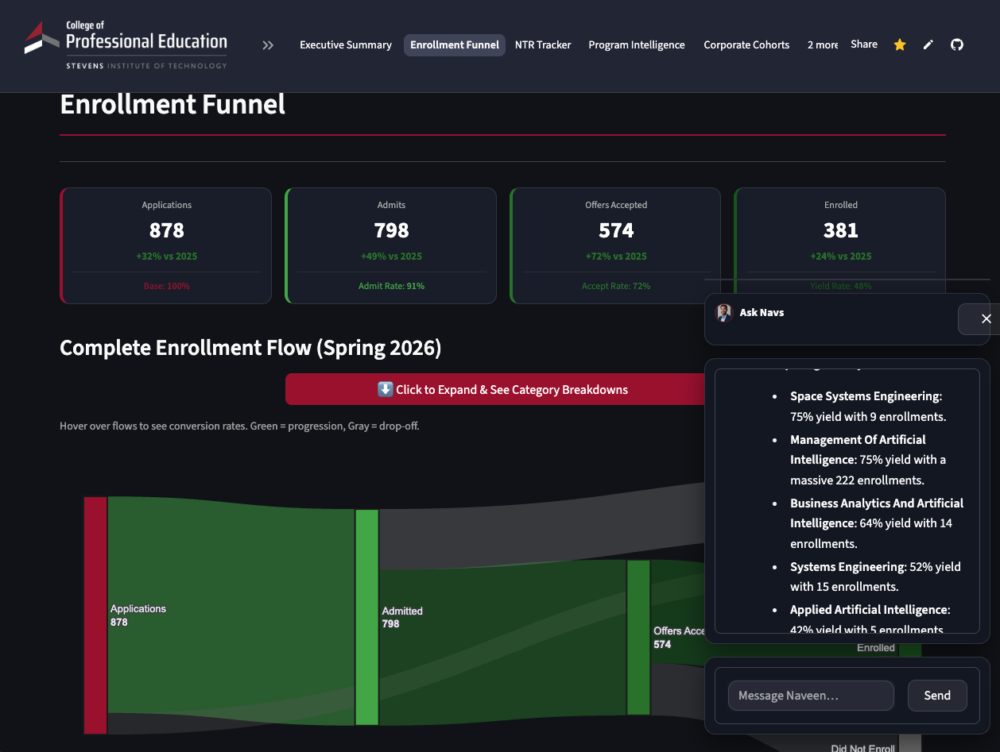
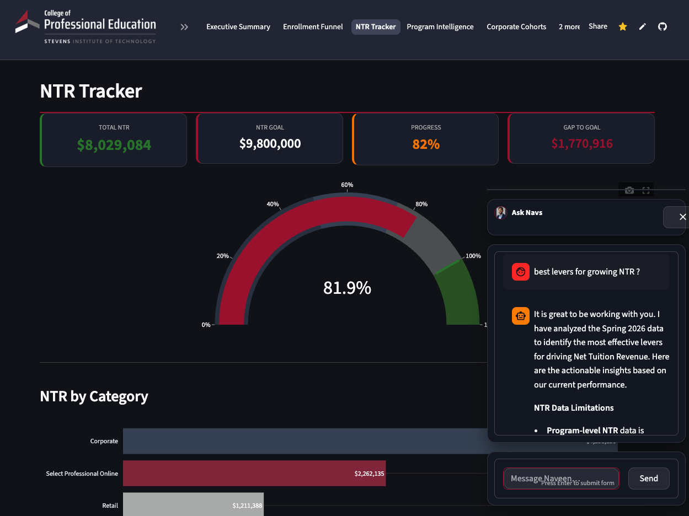
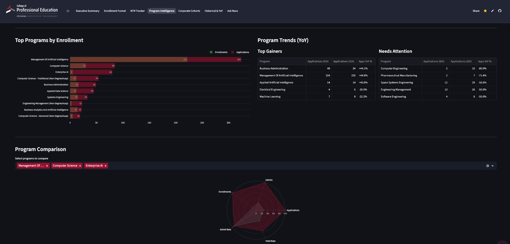
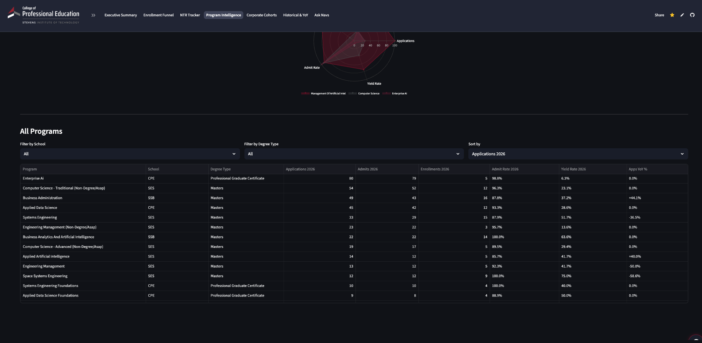
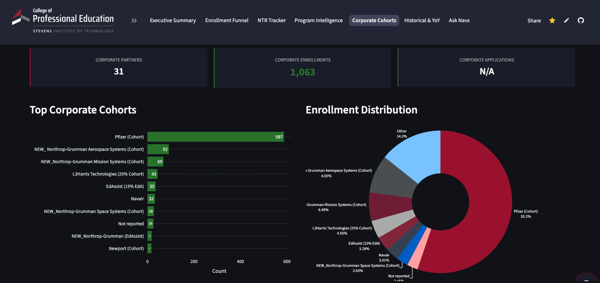
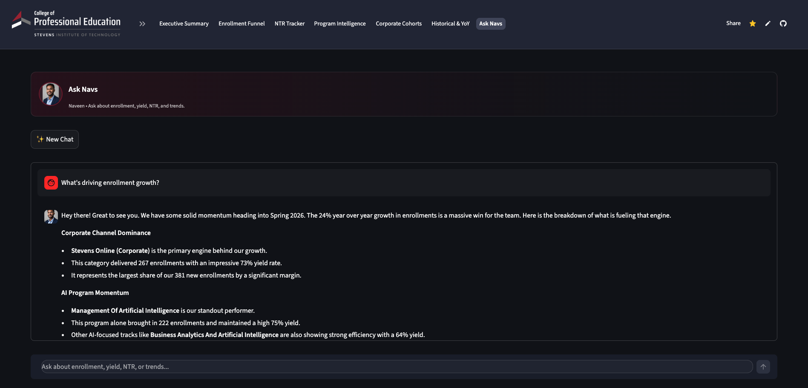

# Project Iris - Stevens AI and BI Software
  by Naveen Mathews Renji  

## Table of Contents
1. Executive Summary (What the system does)
2. System Architecture Overview (High level)
3. Data Engineering Pipeline (Ingestion + snapshots + caching)
4. Analytics Layer (Funnel, yield, NTR, cohorts, YoY)
5. AI Assistant System (Ask Navs, persona: Naveen)
6. UI Walkthrough (Screenshots by page)
7. Security and Deployment
8. Demo Script (Recommended flow)

## 1. Executive Summary (What the system does)

Project Iris is an AI-powered enrollment analytics and intelligence platform built for Stevens CPE. It unifies Slate funnel data and Census headcount data into a single dashboard, and adds a conversational AI assistant for natural language exploration.

### Key Capabilities
-   Enrollment funnel analytics  : Applications -> Admits -> Offers Accepted -> Enrollments
-   NTR tracking  : Goal progress, category and degree breakdowns, gap to goal
-   Program intelligence  : Heatmaps, top programs, YoY trends, comparisons
-   Corporate cohorts  : Partner headcount, distribution, and top cohort tracking
-   Historical YoY  : 3-year trends, conversion/yield trends over time
-   Ask Navs AI assistant  : Page-aware chat available as a floating widget and a dedicated page

## 2. System Architecture Overview (High level)

Aligned with Section 3 of `AI_SYSTEMS_TECHNICAL_DOSSIER.md`.

At a high level, the platform has four layers:
-   Ingestion  : Slate API + Census sources (including snapshot files)
-   Analytics  : Funnel metrics, program stats, NTR calculation, cohort summaries
-   AI layer  : Gemini-powered assistant grounded with structured context and guardrails
-   UI  : Streamlit pages plus an always-available floating chat assistant

## 3. Data Engineering Pipeline (Ingestion + snapshots + caching)

Aligned with Section 4 of `AI_SYSTEMS_TECHNICAL_DOSSIER.md`.

### Data Sources
-   Slate CRM  : Application funnel data via API or snapshot
-   Census  : Headcount and credit-based attributes (used for continuing/returning and NTR)

### Snapshot-first design
The app prioritizes `data/snapshots/` so local and cloud deployments are deterministic and do not depend on local file paths.

### Caching and refresh
Data is cached to avoid repeated fetch and heavy processing, with explicit refresh controls and a periodic refresh window.

## 4. Analytics Layer (Funnel, yield, NTR, cohorts, YoY)

Aligned with Section 5 of `AI_SYSTEMS_TECHNICAL_DOSSIER.md`.

### Core metrics
-   Admit rate  : admits / applications
-   Yield rate  : enrollments / admits
-   Offer accept rate  : offers accepted / admits
-   YoY change  : percent change vs prior year

### NTR model
NTR is calculated using census attributes and credit load, producing:
- Total NTR and progress to goal
- New vs continuing components
- Category and degree breakdowns (where available)

## 5. AI Assistant System (Ask Navs, persona: Naveen)

Aligned with Section 6 of `AI_SYSTEMS_TECHNICAL_DOSSIER.md`.

### Naming and roles
-   Ask Navs  : The feature name and tab label
-   Naveen  : The assistant persona inside Ask Navs

### How it works (high level)
- Uses Google Gemini as the LLM
- Uses structured, data-grounded context with guardrails to avoid fabrication
- Uses a two-stage approach: first select relevant context categories, then build the final context and answer
- Maintains conversation memory via summarization

## 6. UI Walkthrough (Screenshots by page)

### 6.1 Executive Summary

 
-   AI Insights  : A concise, data-grounded narrative of the current state
-   Funnel KPIs  : Applications, admits, enrollments, and yield with YoY context
-   Headcount Breakdown  : New (Slate) plus continuing and returning (Census)
-   Ask Navs widget  : Floating assistant for quick questions without leaving the page

### 6.2 Enrollment Funnel

 
-   Stage cards  : Applications, admits, offers accepted, enrolled
-   Sankey flow  : Visual progression and drop-off through the funnel
-   Expandable category breakouts  : Drill down by category when expanded

 
-   Conversion waterfall  : Where students drop at each stage
-   YoY table  : Quick comparison across 2024, 2025, 2026
-   By school  : Funnel volume by school

### 6.3 NTR Tracker

 
-   Goal tracking  : Total NTR, goal, progress percentage, gap to goal
-   Category breakdown  : NTR composition across enrollment categories
-   Ask Navs  : Ask for levers and action plan grounded in the current data

### 6.4 Program Intelligence

 
-   Heatmap  : Program performance across apps, admits, enrollments
-   Programs by school  : Distribution across schools

 
-   Top programs  : Highest enrollment contributors
-   Top gainers / needs attention  : YoY deltas for quick prioritization
-   Program comparison  : Radar chart for side-by-side analysis

 
-   Filters  : School and degree type
-   Sort and scan  : Applications, admits, enrollments, yield, YoY

### 6.5 Corporate Cohorts

 
-   Corporate partner view  : Partners, enrollments, distribution
-   Top cohorts  : Who is driving corporate headcount

### 6.6 Historical and YoY

 
-   3-year trends  : Applications, admits, enrollments
-   YoY summary  : Table view for quick reference
-   Category mix  : 2026 enrollment distribution by category

 
-   School trend  : Applications by school across 3 years
-   Conversion rates over time  : Admit rate and yield rate trends
-   YoY change by category  : Where growth and decline is concentrated

### 6.7 Ask Navs (Dedicated AI page)

 
-   Natural language analytics  : Ask questions and get grounded answers
-   Actionable breakdowns  : Responses structured into short sections and bullets
-   Consistent voice  : Friendly and confident, but professional

## 7. Security and Deployment

Aligned with Sections 9 and 10 of `AI_SYSTEMS_TECHNICAL_DOSSIER.md`.

### Security
- Password-protected access via Streamlit secrets
- API keys stored in secrets, not in code
- Aggregate analytics only (no student-level PII displayed in the UI)

January 2026.
